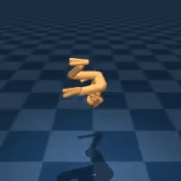
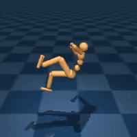
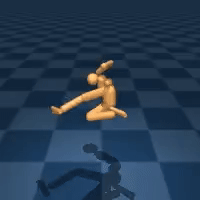

# RL algorithms
This repository contains few of reinforcement learning algorithms.\
I implemented them from original papers for educational purposes.\
Later on I tested them on dm control suite benchmark:
https://github.com/google-deepmind/dm_control/blob/main/dm_control/suite/README.md

## Some visualizations from training

### Cheetah
after 100 episodes of training|after 1900 episodes of training
--|--
|

### Humanoid
after 100 episodes of training|after 2000 episodes of training|after 2500 episodes of training|after 10550 episodes of training|after 29750 episodes of training
--|--|--|--|--
|||||

## Algorithms

### DDPG
From paper:
https://arxiv.org/pdf/1509.02971

### T3D
From paper:
https://arxiv.org/pdf/1802.09477

### DQN 
From paper:
https://arxiv.org/pdf/1312.5602

